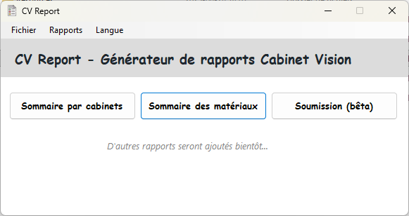
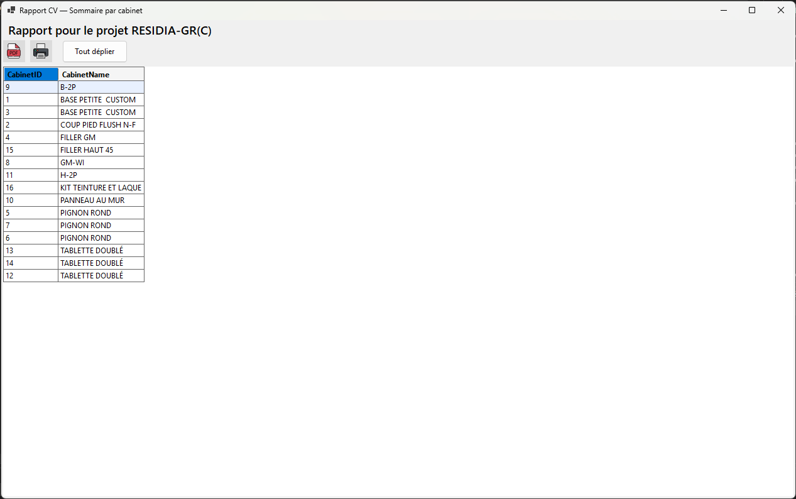
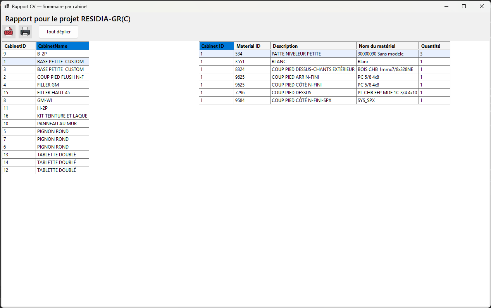
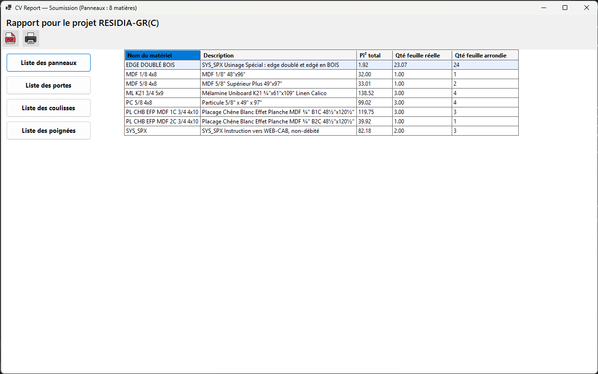
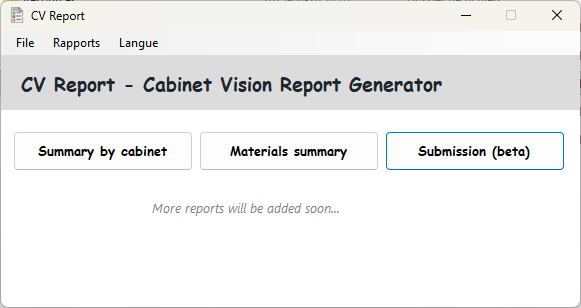
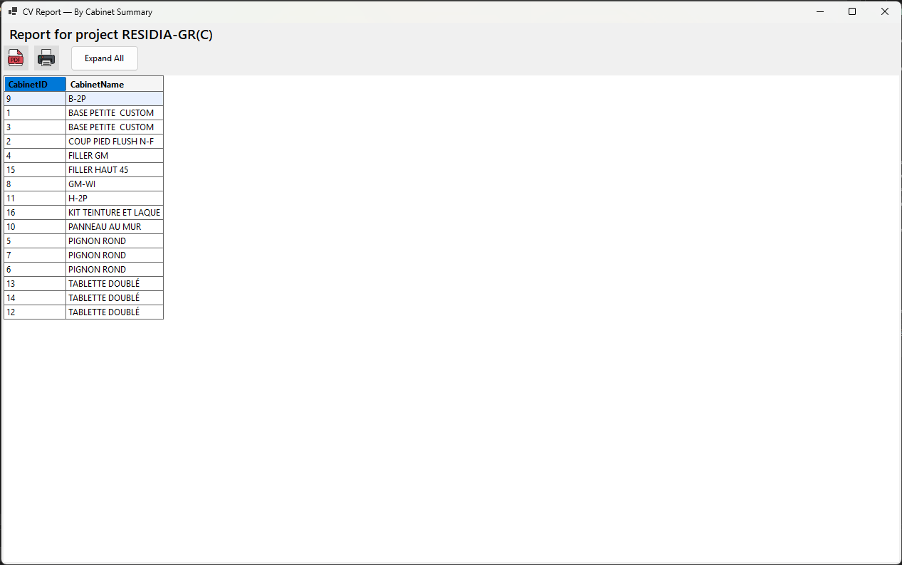
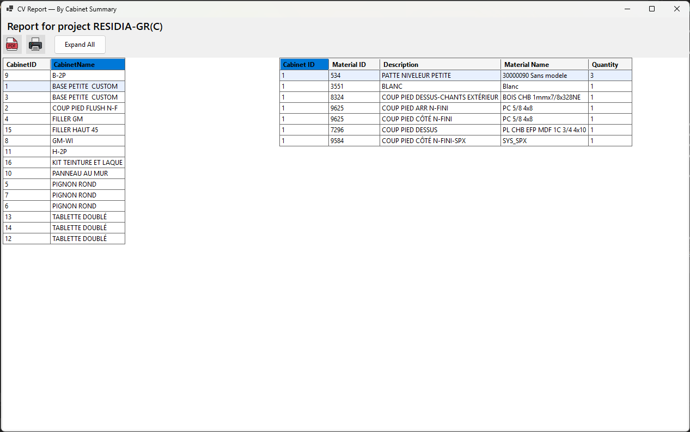
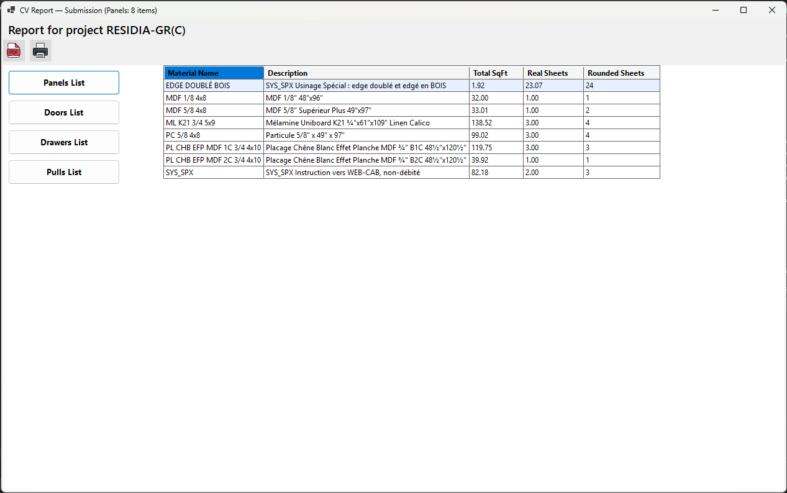

# CV Report

---

## 🇫🇷 Présentation (Français)

**CV Report** est une application Windows développée en **.NET 9 (WinForms)** qui génère des rapports clairs, structurés et imprimables à partir des données **Cabinet Vision** (**CVData**).  
L’interface est simple, moderne, et permet l’**export PDF** ainsi que l’**impression** directe.

### ✨ Fonctionnalités
- **Sommaire par cabinet** : liste des cabinets et leurs matériaux associés.
- **Sommaire des matériaux** : agrégation automatique des quantités par unité (feuilles, pi², pi.l., pièces).
- **Soumission** : génération des listes **Panneaux**, **Portes**, **Coulisses**, **Poignées** pour faciliter le calcul des quantités.
- **I18n** : prise en charge multilingue via fichiers JSON dans `Languages/` (ex. `fr.json`, `en.json`).
- **UI** : titre de rapport dynamique (projet courant), actions **PDF** / **Print**, et boutons d’expansion quand pertinent.

### 🛠️ Prérequis
1. **Cabinet Vision 2024 ou supérieur** installé.
2. Accès à la base **CVData** et/ou au fichier **report.mdf**.
3. Un login SQL (ex. `reporting`) **doit exister** dans la base et être présent dans la configuration (voir ci-dessous).
4. **.NET 9** pour compiler (si vous construisez depuis les sources).

> 👉 Vous pouvez utiliser **SQLUserForge** pour créer/configurer rapidement le login SQL :  
> Repo : https://github.com/plumedours/SQLUserForge/  
> Releases : https://github.com/plumedours/SQLUserForge/releases

---

## ⚙️ Configuration

Les paramètres se font dans **`appsettings.Development.json`** (non versionné en production).  
Un fichier modèle **`appsettings.json`** est fourni comme **template** (copiez-le sous `appsettings.Development.json` et adaptez).

### Clés importantes
- `ConnectionStrings.ReportDb_ByAttach` : attache directe d’un `report.mdf` local.
- `ConnectionStrings.ReportDb_ByName` : connexion par nom de catalogue (utilise le MDF sous-jacent).
- `ConnectionStrings.MainServerTemplate` : gabarit de chaîne pour serveur principal (ex. `CVData`).
- `ConnectionStrings.MainServerSqlAuth` : credentials SQL si vous utilisez SQL Auth (sinon Integrated Security).
- `ActiveConnectionString` : nom de la chaîne **active** parmi celles ci-dessus.
- `Localization.*` : configuration de la langue par défaut, langue courante et dossier des fichiers.

### Exemple de `appsettings.Development.json`
> ℹ️ Exemple fourni par l’auteur. Si ces valeurs ne sont pas sensibles dans votre contexte, vous pouvez les réutiliser **à titre d’exemple** uniquement. **Adaptez-les** à votre environnement avant usage.

```json
{
  "ConnectionStrings": {
    "ReportDb_ByAttach": "Server=(localdb)\\CV24;AttachDbFilename=C:\\Cabinet Vision\\CV 2024\\Database\\report.mdf;Integrated Security=True;MultipleActiveResultSets=True;TrustServerCertificate=True;Connect Timeout=30",
    "ReportDb_ByName": "Server=(localdb)\\CV24;Integrated Security=True;MultipleActiveResultSets=True;TrustServerCertificate=True;Connect Timeout=30;Initial Catalog=CV-C:\\Cabinet Vision\\CV 2024\\Database\\report.mdf",
    "MainServerTemplate": "Server={MACHINE}\\CV24;Database=CVData;Integrated Security=True;MultipleActiveResultSets=True;TrustServerCertificate=True;Connect Timeout=30",

    "MainServerSqlAuth": {
      "User": "LOGIN",
      "Password": "PASS"
    }
  },
  "ActiveConnectionString": "ReportDb_ByAttach",
  "Localization": {
    "DefaultLanguage": "fr",
    "CurrentLanguage": "fr",
    "LanguagesFolder": "Languages"
  }
}
```

> 🔐 **Bonnes pratiques** : gardez `appsettings.Development.json` en local, en dehors du contrôle de source public si vous y mettez de vrais identifiants.

---

## 🌍 Localisation (i18n)

- Placez vos fichiers de langue dans **`Languages/`** (ex. `fr.json`, `en.json`).  
- Le **Menu Langues** affiche automatiquement les **codes en majuscules** (ex. `FR`, `EN`) basés sur le nom du fichier.  
- Pour traduire l’UI, les contrôles utilisent des **clés i18n** via un service central (`TranslationService`) et un **`Translator`** qui applique la traduction aux formulaires, menus, tooltips et entêtes de colonnes (`DataGridView`).

### Ajouter une langue
1. Créez `Languages/es.json` (par exemple).
2. Mettez vos clés/valeurs (copiez depuis `en.json` ou `fr.json` et traduisez).
3. Redémarrez l’app → le sous-menu affichera **ES**.

---

## ▶️ Utilisation (rappel)
1. Ouvrez votre projet dans **Cabinet Vision**.  
2. Cliquez sur l’onglet **Rapport**.  
3. Cliquez sur **Centre de devis**.  
4. Ouvrez **CV Report** et cliquez sur un bouton de rapport (Cabinets / Matériaux / Soumission).  
5. Imprimez ou exportez en **PDF** le rapport généré.

---

## 📸 Captures d'écran

<p float="left">
  <a href="Resources/fr01.png"></a>
  <a href="Resources/fr02.png"></a>
  <a href="Resources/fr03.png"></a>
  <a href="Resources/fr04.png"></a>
</p>

---

## 📥 Téléchargement et installation

- Téléchargez la dernière release ici : [CV Report Releases](https://github.com/plumedours/CVReport/releases)  
- Extrayez l'archive `.zip` dans le dossier de votre choix.  
- (Optionnel) Ajoutez une exclusion antivirus si nécessaire.  
- Lancez **CVReport.exe** pour démarrer l'application.

---

## 🧱 Construction & Publication

### Depuis les sources
- Requiert **.NET 9 SDK**.  
- Ouvrez la solution, compilez en `Release`.

### Publication (exemple Visual Studio)
- Cible : **Folder**  
- Runtime : **win-x64** (recommandé) ou **win-x86**  
- Option : **Single file** possible  
- Le dossier `publish/` contiendra le `.exe` et/ou les dépendances.

> 💡 Pour afficher une version “courte” (ex. `1.0.5`) dans l’About : définissez dans le `.csproj`  
> `<InformationalVersion>1.0.5</InformationalVersion>` et utilisez cette valeur à l’affichage.

---

## 👤 Auteur
Développé par **Maxime Bory** — retours et suggestions bienvenus.
GitHub : [https://github.com/plumedours](https://github.com/plumedours)  

---

### 💖 Me soutenir
Appréciez-vous mon travail ? Vous pouvez m’encourager en [m’offrant un café sur Ko-fi](https://ko-fi.com/borymaxime).
Merci beaucoup pour votre soutien ! ☕✨

---

# 🇬🇧 English

**CV Report** is a Windows application built with **.NET 9 (WinForms)** that generates clear, structured, printable reports from **Cabinet Vision** (**CVData**) data.  
The UI is straightforward and modern, with **PDF export** and direct **printing**.

### ✨ Features
- **By Cabinet Summary**: lists cabinets and their associated materials.
- **Materials Summary**: automatically aggregates quantities by unit (sheets, sqft, linear ft, pieces).
- **Submission**: generates **Panels**, **Doors**, **Drawers**, **Pulls** lists to simplify quantity calculations.
- **I18n**: multilingual support via JSON files under `Languages/` (e.g., `fr.json`, `en.json`).
- **UI**: dynamic report title (current project), **PDF** / **Print** actions, and expand/collapse when relevant.

### 🛠️ Requirements
1. **Cabinet Vision 2024 or later** installed.
2. Access to **CVData** and/or local **report.mdf** file.
3. A SQL login (e.g., `reporting`) must exist in the database and be present in config.
4. **.NET 9** to build from source.

> 👉 Use **SQLUserForge** to quickly create/configure the SQL login:  
> Repo: https://github.com/plumedours/SQLUserForge/  
> Releases: https://github.com/plumedours/SQLUserForge/releases

---

## ⚙️ Configuration

Use **`appsettings.Development.json`** for local credentials/settings.  
A **template** file is provided as **`appsettings.json`** (copy → `appsettings.Development.json` and edit).

### Key settings
- `ConnectionStrings.ReportDb_ByAttach` — directly attach a local `report.mdf`.
- `ConnectionStrings.ReportDb_ByName` — connect by catalog name (backed by the MDF).
- `ConnectionStrings.MainServerTemplate` — template connection string to your main server (e.g., `CVData`).
- `ConnectionStrings.MainServerSqlAuth` — SQL auth credentials if not using Integrated Security.
- `ActiveConnectionString` — which connection to use by default.
- `Localization.*` — language defaults and `Languages` folder.

### Example `appsettings.Development.json`
> ℹ️ Example provided by the author. If these values are not sensitive in your environment, you may reuse them **as an example**. **Adapt** before use.

```json
{
  "ConnectionStrings": {
    "ReportDb_ByAttach": "Server=(localdb)\\CV24;AttachDbFilename=C:\\Cabinet Vision\\CV 2024\\Database\\report.mdf;Integrated Security=True;MultipleActiveResultSets=True;TrustServerCertificate=True;Connect Timeout=30",
    "ReportDb_ByName": "Server=(localdb)\\CV24;Integrated Security=True;MultipleActiveResultSets=True;TrustServerCertificate=True;Connect Timeout=30;Initial Catalog=CV-C:\\Cabinet Vision\\CV 2024\\Database\\report.mdf",
    "MainServerTemplate": "Server={MACHINE}\\CV24;Database=CVData;Integrated Security=True;MultipleActiveResultSets=True;TrustServerCertificate=True;Connect Timeout=30",

    "MainServerSqlAuth": {
      "User": "LOGIN",
      "Password": "PASS"
    }
  },
  "ActiveConnectionString": "ReportDb_ByAttach",
  "Localization": {
    "DefaultLanguage": "fr",
    "CurrentLanguage": "fr",
    "LanguagesFolder": "Languages"
  }
}
```

> 🔐 **Best practice**: keep real credentials in `appsettings.Development.json`, out of public source control when possible.

---

## 🌍 Localization (i18n)

- Place language files in **`Languages/`** (e.g., `fr.json`, `en.json`).  
- The **Language menu** automatically displays the **uppercase codes** (e.g., `FR`, `EN`) based on file names.  
- A central `TranslationService` and `Translator` apply translations to forms, menus, tooltips, and `DataGridView` column headers.

### Add a new language
1. Create `Languages/es.json` (for example).
2. Copy keys from `en.json`/`fr.json` and translate.
3. Restart the app → the submenu will show **ES**.

---

## ▶️ Usage (quick recap)
1. Open your project in **Cabinet Vision**.  
2. Go to the **Report** tab.  
3. Click **Quote Center**.  
4. Launch **CV Report** and choose a report type (Cabinets / Materials / Submission).  
5. Print or export the generated report to **PDF**.

---

## 📸 Screenshots

<p float="left">
  <a href="Resources/en01.png"></a>
  <a href="Resources/en02.png"></a>
  <a href="Resources/en03.png"></a>
  <a href="Resources/en04.png"></a>
</p>

---

## 📥 Download and installation

- Download the latest release here: [CV Report Releases](https://github.com/plumedours/CVReport/releases)  
- Extract the `.zip` archive to a folder of your choice.  
- (Optional) Add an antivirus exclusion if required.  
- Run **CVReport.exe** to start the application.

---

## 🧱 Build & Publish

### From source
- Requires **.NET 9 SDK**.  
- Open the solution, build in `Release`.

### Publish (Visual Studio example)
- Target: **Folder**  
- Runtime: **win-x64** (recommended) or **win-x86**  
- Option: **Single file** supported  
- The `publish/` folder will contain the `.exe` and/or dependencies.

> 💡 To show a “short” version (e.g., `1.0.5`) in About: set in `.csproj`  
> `<InformationalVersion>1.0.5</InformationalVersion>` and read that value in the UI.

---

## 👤 Author
Developed by **Maxime Bory** — feedback and contributions are welcome.
GitHub: [https://github.com/plumedours](https://github.com/plumedours)  

---

### 💖 Support me
Enjoying my work? You can support me by [buying me a coffee on Ko-fi](https://ko-fi.com/borymaxime).
Thank you so much for your support! ☕✨